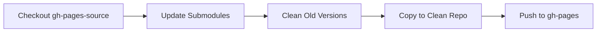

# Keypop API Documentation

[](https://opensource.org/licenses/MIT)

Central repository for API documentation of all **Eclipse Keypop** libraries, including both **Java** (Javadoc) and
**C++** (Doxygen) references.

Published at: [https://docs.keypop.org/](https://docs.keypop.org/)

---

## Table of Contents

- [Architecture](#architecture)
- [Branch Structure](#branch-structure)
- [Automated Publication Workflow](#automated-publication-workflow)
- [Managing Documentation](#managing-documentation)
- [Maintenance & Troubleshooting](#maintenance--troubleshooting)

---

## Architecture

This repository aggregates documentation from multiple Keypop libraries using **Git submodules**. Each library maintains its own documentation in its repository's `doc` branch, and this repository automatically publishes a consolidated view.

### Key Components

1. **Submodules**: Each Keypop library is included as a Git submodule
2. **Workflow**: GitHub Actions automatically updates and publishes documentation
3. **Version Management**: Old patch versions are automatically cleaned (keeps only latest per minor version)

---

## Branch Structure

### `main`
- **Purpose**: Repository configuration and automation scripts
- **Contains**:
  - Workflow definitions (`.github/workflows/`)
  - Publication script (`.github/scripts/update_and_publish.sh`)
  - This README
- **Who modifies**: DevOps/maintainers

### `gh-pages-source`
- **Purpose**: Source configuration for documentation
- **Contains**:
  - Git submodule definitions (`.gitmodules`)
  - Jekyll configuration (`_config.yml`, `_layouts/`)
  - Index pages
- **Who modifies**: When adding/removing libraries

### `gh-pages`
- **Purpose**: Published documentation (auto-generated, **do not edit manually**)
- **Contains**:
  - All extracted documentation from submodules
  - Jekyll site ready for GitHub Pages
- **Who modifies**: Automated workflow only

---

## Automated Publication Workflow

### Trigger Events

The workflow runs automatically on:
- **Manual trigger**: Via GitHub Actions UI
- **Repository dispatch**: When a library publishes new docs

### Workflow Steps



#### 1. **Update Submodules**
Fetches latest documentation from all library `doc` branches.

#### 2. **Clean Old Patch Versions**
Removes outdated patch versions to save space:
- Keeps: `2.1.0`, `2.2.5`, `3.0.1` (latest per minor)
- Removes: `2.2.0`, `2.2.1`, `2.2.2`, `2.2.3`, `2.2.4`

#### 3. **Prepare Clean Repository**
Copies documentation files excluding Git metadata:
```bash
rsync -a --exclude='.git' --exclude='.gitmodules'
```

#### 4. **Force Push to gh-pages**
Publishes consolidated documentation to GitHub Pages.

### Monitoring

View workflow runs: [Actions > Update Submodules and Publish](../../actions/workflows/update-submodules.yml)

Logs are organized in collapsible groups:
- Updating submodules
- Cleaning old patch versions
- Preparing clean GH Pages repository
- Pushing to gh-pages

---

## Managing Documentation

### Adding a New Library

1. **Switch to gh-pages-source branch**:
```bash
git checkout gh-pages-source
```

2. **Add submodule**:
```bash
git submodule add -b doc \
  https://github.com/eclipse-keypop/[library-name].git \
  [library-name]
```

3. **Commit and push**:
```bash
git add .gitmodules [library-name]
git commit -m "feat: add documentation for [library-name]"
git push origin gh-pages-source
```

4. **Trigger workflow**: The documentation will be published automatically on next run.

### Removing a Library

1. **Switch to gh-pages-source branch**:
```bash
git checkout gh-pages-source
```

2. **Remove submodule**:
```bash
git submodule deinit -f [library-name]
rm -rf .git/modules/[library-name]
git rm -f [library-name]
```

3. **Commit and push**:
```bash
git commit -m "feat: remove documentation for [library-name]"
git push origin gh-pages-source
```

### Manually Triggering Publication

1. Go to [Actions](../../actions/workflows/update-submodules.yml)
2. Click "Run workflow"
3. Select branch `main`
4. Click "Run workflow"

---

## Maintenance & Troubleshooting

### Workflow Script

The publication logic is in: `.github/scripts/update_and_publish.sh`

The script is automatically fetched from `main` branch during workflow execution. To modify it:
1. Edit on `main` branch
2. Push changes
3. Next workflow run will use updated script

### Monitoring

View workflow runs: [Actions > Update Submodules and Publish](../../actions/workflows/update-submodules.yml)

View logs with GitHub CLI:
```bash
gh run list --workflow=update-submodules.yml --limit 5
gh run view [RUN_ID] --log
```

## Contributing

Please read our [contribution guidelines](https://keypop.org/community/contributing/) before submitting any changes.

## License

This project is licensed under the MIT License. See [LICENSE](LICENSE) for details.